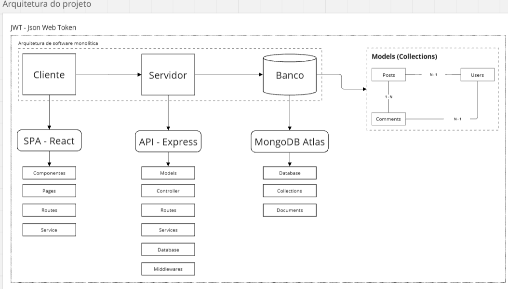

# Arquitetura Monolítica de Software

A arquitetura monolítica é um modelo em que toda a aplicação é desenvolvida e implantada como **um único bloco**, reunindo **cliente, servidor e banco de dados** de forma integrada.

Isso traz simplicidade inicial no desenvolvimento, mas pode gerar dificuldades de **escalabilidade** e **manutenção** conforme o sistema cresce.

---

## 🔹 Visão Geral

O sistema é dividido em **três camadas principais**:

1. Cliente (SPA - React)  
2. Servidor (API - Express)  
3. Banco de Dados (MongoDB Atlas)  

Essas camadas trabalham juntas dentro de uma **única aplicação monolítica**.

---

🖥️ Cliente (SPA - React)

O cliente é a interface que o usuário final acessa (**Frontend**).  
Aqui é usado **React**, estruturado como uma **Single Page Application (SPA)**, que carrega uma única página e atualiza apenas partes necessárias sem recarregar a aplicação inteira.

**Estrutura no cliente:**
- **Components:** blocos reutilizáveis de UI (botões, formulários, cards etc.).
- **Pages:** telas completas, compostas por vários componentes.
- **Routes:** definem a navegação entre páginas (ex: `/login`, `/posts`).
- **Service:** camada que faz chamadas à API, integrando frontend com backend.

👉 **Exemplo:** o usuário clica em "Publicar Post" → o React coleta os dados do formulário e envia ao servidor.

---

⚙️ Servidor (API - Express)

O servidor contém a **lógica da aplicação (Backend)**.  
Aqui é usado **Express**, um framework para Node.js que facilita a criação de **APIs REST**.

**Estrutura no servidor:**
- **Models:** definem a estrutura dos dados (como usuários, posts, comentários).
- **Controller:** recebem as requisições do cliente e decidem o que fazer.
- **Routes:** organizam as URLs da API.
- **Services:** camada de regras de negócio (ex: validar senha, calcular permissões).
- **Database:** responsável pela integração com o banco.
- **Middlewares:** funções intermediárias (ex: autenticação JWT, logs, validações).

👉 **Exemplo:** ao receber uma requisição de login, o servidor valida as credenciais, gera um **JWT (JSON Web Token)** e retorna ao cliente.

---

🗄️ Banco de Dados (MongoDB Atlas)

O banco é responsável pelo **armazenamento persistente dos dados**.  
Aqui é usado o **MongoDB Atlas**, um banco de dados **NoSQL** baseado em documentos JSON.

**Conceitos principais:**
- **Database:** o banco em si, que armazena todas as informações.
- **Collections:** agrupamentos de documentos (equivalente a tabelas no SQL).
- **Documents:** registros individuais em formato JSON (equivalente a linhas no SQL).

**No exemplo do diagrama:**
- **Users:** guarda dados dos usuários (nome, email, senha...).
- **Posts:** armazena as publicações feitas.
- **Comments:** comentários feitos nos posts.

**Relações:**
- Um usuário pode ter **N posts**.
- Um post pode ter **N comentários**.
- Um comentário pertence a **1 usuário** e a **1 post**.

---

🔐 JWT (Json Web Token)

O **JWT** é usado para **autenticação e autorização**.

- Após o login, o servidor gera um token assinado digitalmente.  
- O cliente guarda esse token (localStorage ou cookies).  
- Em cada requisição protegida, o cliente envia o token.  
- O servidor valida o token antes de liberar o acesso.  

👉 Isso garante **segurança** sem necessidade de manter sessões no servidor.

---

## ✅ Vantagens x ⚠️ Desvantagens

| ✅ Vantagens | ⚠️ Desvantagens |
|--------------|-----------------|
| Simplicidade no desenvolvimento inicial | Dificuldade de manutenção quando cresce |
| Facilidade de testar e implantar (um único pacote) | Escalabilidade limitada (tudo escala junto) |
| Boa escolha para projetos pequenos e médios | Atualizações exigem redeploy completo |

---

📌 **Resumo:**  
Essa arquitetura monolítica com **React + Express + MongoDB Atlas + JWT** é bastante utilizada em aplicações web modernas de **pequeno e médio porte**, permitindo integrar **frontend, backend e banco** de forma simples, organizada e eficiente.
